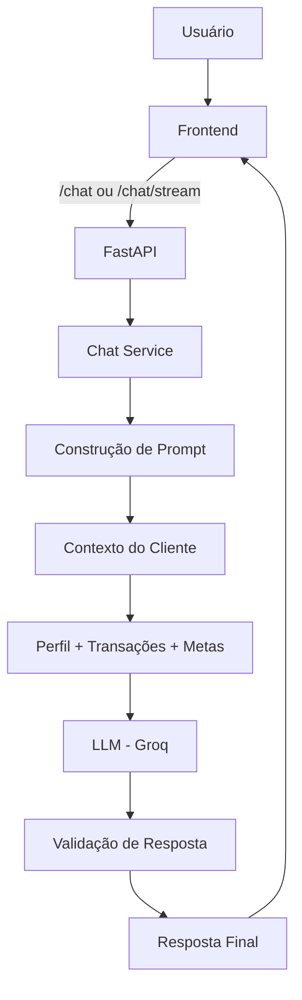

<div align="center">


<br/>

[](https://python.org)
[](https://fastapi.tiangolo.com)
[](https://groq.com)
[](LICENSE)
[](https://github.com/AgathaCRuiz)

<br/>

> **Agente financeiro proativo com IA Generativa** — que não apenas responde perguntas,  
> mas antecipa necessidades, personaliza sugestões e cocria soluções financeiras  
> com base no perfil real do cliente via API REST + frontend interativo.

<br/>

</div>

---

## ✦ Sobre o Projeto

**Edu** é um assistente financeiro inteligente que vai além dos chatbots tradicionais. Desenvolvido como uma evolução de um desafio da DIO, o projeto transforma uma IA convencional em um **agente especializado e contextualizado**, capaz de:

- 💡 **Antecipar necessidades** ao invés de apenas responder perguntas
- 🎯 **Personalizar sugestões** com base no perfil e histórico do cliente
- 📊 **Analisar transações** e identificar padrões de gastos em tempo real
- 🛡️ **Garantir segurança** nas respostas financeiras (anti-alucinação)
- 🤝 **Cocriar metas** e estratégias financeiras de forma consultiva

O projeto integra **Engenharia de Prompts avançada**, dados mockados realistas e uma API REST completa com streaming de respostas.

<br/>

## 🗂️ Estrutura do Projeto

```
dio-lab-bia-do-futuro/
│
├── 📁 data/                           # Base de conhecimento do agente
│   ├── transacoes.csv                 # Histórico de transações do cliente
│   ├── historico_atendimento.csv      # Atendimentos anteriores
│   ├── perfil_investidor.json         # Perfil, metas e patrimônio
│   └── produtos_financeiros.json      # Produtos e serviços disponíveis
│
├── 📁 docs/                           # Documentação do projeto
│   ├── 01-documentacao-agente.md      # Caso de uso e arquitetura
│   ├── 02-base-conhecimento.md        # Estratégia de dados
│   ├── 03-prompts.md                  # Engenharia de prompts
│   ├── 04-metricas.md                 # Avaliação e métricas
│   └── 05-pitch.md                    # Roteiro do pitch
│
├── 📁 src/                            # Código Python reutilizável
│   └── services/
│       └── chat_service.py            # Serviço de conversa com o LLM
│
├── 📁 frontend/                       # Interface interativa (React/Vite)
│
├── 📁 assets/                         # Imagens e diagramas
├── 📁 examples/                       # Referências e exemplos
│
├── main.py                            # Entry point FastAPI
└── README.md
```

<br/>

## 🔄 Arquitetura do Sistema

```
┌─────────────────────────────────────────────────────────────────────────┐
│                        FLUXO COMPLETO DO EDU                            │
└─────────────────────────────────────────────────────────────────────────┘

  ┌─────────────┐     ┌──────────────────┐     ┌─────────────────────┐
  │  Frontend   │────▶│   FastAPI        │────▶│   chat_service.py   │
  │  (React)    │     │   main.py        │     │   + System Prompt   │
  │             │◀────│                  │◀────│   + Contexto        │
  └─────────────┘     └──────────────────┘     └────────┬────────────┘
        │                      │                         │
        │ SSE Streaming        │ REST Endpoints          │ LLM Call
        │                      │                         ▼
        │               ┌──────┴───────┐       ┌─────────────────────┐
        │               │  Data Layer  │       │   Groq API          │
        │               │              │       │   (llama / mixtral) │
        │               │ transacoes   │       └─────────────────────┘
        │               │ perfil       │
        └───────────────│ metas        │
                        │ historico    │
                        └──────────────┘
```



<br/>

## 🌐 Endpoints da API

<div align="center">

|  Método  | Endpoint       | Descrição                                          |
| :------: | :------------- | :------------------------------------------------- |
|  `GET`   | `/`            | Status da API e do agente                          |
|  `GET`   | `/dados`       | Dashboard financeiro completo do cliente           |
|  `GET`   | `/metas`       | Lista de metas com aportes sugeridos e viabilidade |
|  `POST`  | `/metas`       | Adiciona uma nova meta financeira                  |
|  `PUT`   | `/metas/{idx}` | Atualiza uma meta existente                        |
| `DELETE` | `/metas/{idx}` | Remove uma meta                                    |
|  `GET`   | `/historico`   | Histórico de transações com filtros                |
|  `POST`  | `/chat`        | Resposta direta do Edu                             |
|  `GET`   | `/chat/stream` | Resposta em **streaming SSE** (token a token)      |

</div>

<br/>

## 🧠 Engenharia de Prompts

O comportamento do **Edu** é definido por um system prompt cuidadosamente construído que garante:

```
┌────────────────────────────────────────────────────────────────┐
│                    CAMADAS DO SYSTEM PROMPT                    │
├────────────────────────────────────────────────────────────────┤
│  1. PERSONA     →  Edu, consultor financeiro empático e claro  │
│  2. CONTEXTO    →  Perfil do cliente + dados financeiros reais │
│  3. RESTRIÇÕES  →  Anti-alucinação + sem opiniões sobre ativos │
│  4. TOM         →  Consultivo, não prescritivo                 │
│  5. FORMATO     →  Respostas estruturadas e acionáveis         │
└────────────────────────────────────────────────────────────────┘
```

**Segurança contra alucinações:** O agente só responde com base nos dados disponíveis na base de conhecimento. Quando não tem informação suficiente, indica explicitamente ao usuário.

<br/>

## 📊 Base de Conhecimento

| Arquivo                     | Tipo | O que contém                                         |
| :-------------------------- | :--: | :--------------------------------------------------- |
| `transacoes.csv`            | CSV  | Histórico de entradas e saídas por categoria e data  |
| `historico_atendimento.csv` | CSV  | Contexto de conversas e atendimentos anteriores      |
| `perfil_investidor.json`    | JSON | Perfil de risco, renda, patrimônio, metas e reserva  |
| `produtos_financeiros.json` | JSON | Produtos disponíveis para recomendação personalizada |

<br/>

## 💰 Funcionalidades do Dashboard

O endpoint `/dados` retorna um panorama financeiro completo, calculado dinamicamente:

```json
{
  "perfil": {
    "nome": "...",
    "renda_mensal": 5000,
    "patrimonio_total": 42000,
    "perfil_investidor": "moderado",
    "objetivo": "independência financeira"
  },
  "metricas": {
    "total_receita": 5000.0,
    "total_gastos": 3820.0,
    "saldo_mes": 1180.0,
    "taxa_poupanca": 23.6
  },
  "gastos_categoria": [...],
  "metas": [...],
  "reserva": {
    "atual": 8000,
    "necessaria": 15000,
    "meses_cobertos": 2.1,
    "percentual": 53.3
  }
}
```

<br/>

## 🚀 Como Executar

### Pré-requisitos

- Python 3.11+
- Chave de API Groq (gratuita em [console.groq.com](https://console.groq.com))
- Node.js 18+ (opcional, para o frontend)

### Instalação

```bash
# 1. Clone o repositório
git clone https://github.com/AgathaCRuiz/dio-lab-bia-do-futuro.git
cd dio-lab-bia-do-futuro

# 2. Crie e ative o ambiente virtual
python -m venv .venv
source .venv/bin/activate        # Linux / macOS
.venv\Scripts\activate           # Windows

# 3. Instale as dependências
pip install -r requirements.txt

# 4. Configure a chave de API
cp .env.example .env
# Edite o .env e adicione sua GROQ_API_KEY
```

### Rodando a API

```bash
uvicorn main:app --reload --host 0.0.0.0 --port 8000
```

Acesse a documentação interativa em: **http://localhost:8000/docs**

### Exemplos de uso

**Chat simples:**

```bash
curl -X POST http://localhost:8000/chat \
  -H "Content-Type: application/json" \
  -d '{"mensagem": "Como estão meus gastos este mês?"}'
```

**Chat com streaming:**

```bash
curl "http://localhost:8000/chat/stream?mensagem=Qual+minha+taxa+de+poupança?"
```

**Resposta:**

```json
{
  "resposta": "Olá! Este mês você poupou 23,6% da sua renda — excelente!
               Seu saldo positivo foi de R$ 1.180. Quer que eu sugira
               onde alocar esse valor com base no seu perfil moderado?"
}
```

<br/>

## 🛠 Stack Tecnológica

<div align="center">

| Categoria     | Tecnologias                  |
| :------------ | :--------------------------- |
| **Linguagem** | Python 3.11+                 |
| **API**       | FastAPI, Uvicorn, Pydantic   |
| **LLM**       | Groq API (Llama 3 / Mixtral) |
| **Dados**     | Pandas, JSON, CSV            |
| **Frontend**  | React + Vite (opcional)      |
| **Streaming** | Server-Sent Events (SSE)     |
| **Config**    | python-dotenv                |

</div>

<br/>

## 📁 Documentação Técnica

|  #  | Doc                         | Conteúdo                                      |
| :-: | :-------------------------- | :-------------------------------------------- |
| 01  | `01-documentacao-agente.md` | Caso de uso, persona, arquitetura e segurança |
| 02  | `02-base-conhecimento.md`   | Estratégia de dados e estrutura da base       |
| 03  | `03-prompts.md`             | System prompt, exemplos e edge cases          |
| 04  | `04-metricas.md`            | Métricas de avaliação e qualidade             |
| 05  | `05-pitch.md`               | Roteiro do pitch de 3 minutos                 |

<br/>

---

<div align="center">

Feito com 💚 por [**Agatha C. Ruiz**](https://github.com/AgathaCRuiz)


</div>
